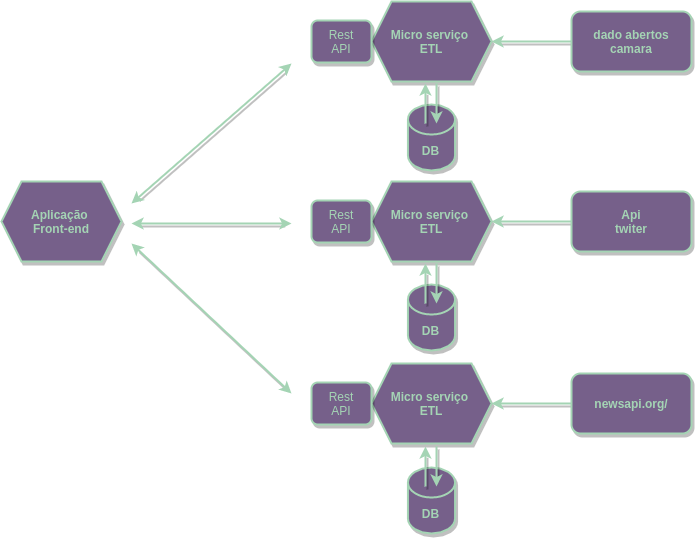

# Documeto de Arquitetura

## Introdução

### Objetivo 

Este documento tem como finalidade mostrar uma visão geral sobre a arquitetura e ferramentas utilizadas no projeto Parlamentaqui.

### Escopo

O Parlamentaqui tem como objetivo ser uma plataforma web responsiva que possibilite visualizar perfis de deputados contendo noticias, dados dos mesmos e coisas relevantes a um deputado, além de mostrar twittes recentes desses deputados caso possuam a rede social. 

### Definições, Acrônimos e Abreviações

- API: Application Programming Interface.
- Framework: Conjuntos de funções e componentes pré definidos.
- ETL: Extract, Transform and Load

## Representação de Arquitetura

### Padrão Arquitetural

O projeto foi modelado seguindo a arquitetura de microserviços utilizando API's para realizar a conexão entre os serviços e o frontend da aplicação. 

A arquitetura de microserviços foi escolhida por ser altamente escalável, pela acessibilidade para os desenvolvedores sendo mais fácil entender os serviços individualmente e por consequentcia os ciclos de desenvolvimentos poderem ser mais rapidos. Estes fatores já poderiam ser suficientes para a escolha desta arquitetura no projeto mas ainda resta a maior resiliencia do projeto, ou seja o projeto fica mais tolerante a falhas, um exemplo disso é caso ocorra alguma falha em um dos serviços isso não afeta os outros pois cada um deles funciona independente do outro.

## Processo de ETL

O processo de etl (Extract, Transform and Load) em si é um processo de extração de dados, e após essa extração há um tratamento destes dados e por fim o carregamento deles em uma base de dados.

Na fase de extração os dados podem vir das mais diversas formas além de ocorrer casos onde existem mais de uma fonte de dados. Por esses motivos é necessário na fase seguinte que é transformar esses dados, pegando apenas a parte que é interessante para o nosso produto deizando livre de inconsistencias e assim deixando os dados compativeis com as regras de negócio que foram definidadas para o nosso projeto.

Com esse procedimento realizado corretamente somente deverá ocorrer o carregamento destes dados no banco de dados escolhido para a nossa aplicação.

## Tecnologias 

- React
- Python Flask
- Docker
- PostgreSQL
- Travis CI
- Git

## Metas e Restrições da Arquitetura

### Metas do Software Parlamentaqui

- Dar acesso a uma home com as últimas interações de políticos no twiter / perfis de politicos e atividades relacionadas (ordenação de acordo com atividades recentes);
- Mostrar projetos votados recentemente, com informações sobre os projetos em seu perfil.
- Possibilitar o compartilhamento inteligente.

Para mais informações vá no documento redigido a partir do [lean inception](./lean_inceptio.md) que contém detalhadamente as metas do projeto.

### Restrições da Arquitetura

- O deputado possuir a rede social do twiter.
- As noticias com o deputado citarem seu nome em algum trecho da noticia.

### Referências

Silva Gomes da Gama e Abreu, Fábio. DESMISTIFICANDO O CONCEITO DE ETL

 - http://www.fsma.edu.br/si/Artigos/V2_Artigo1.pdf

Newman, Sam. Building Microservices.

- https://www.nginx.com/wp-content/uploads/2015/01/Building_Microservices_Nginx.pdf

ETL (extrair, transformar e carregar)

- https://docs.microsoft.com/pt-br/azure/architecture/data-guide/relational-data/etl