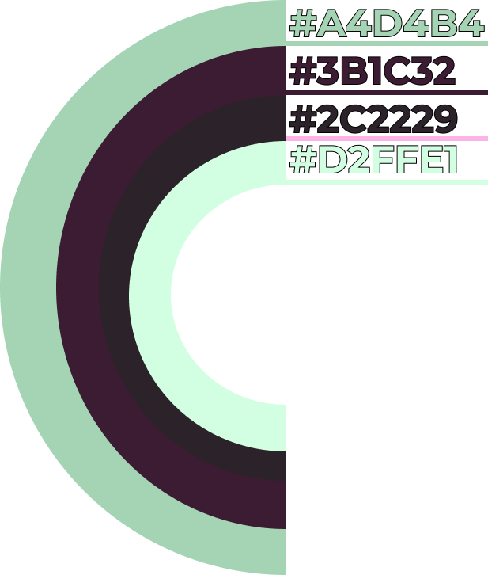
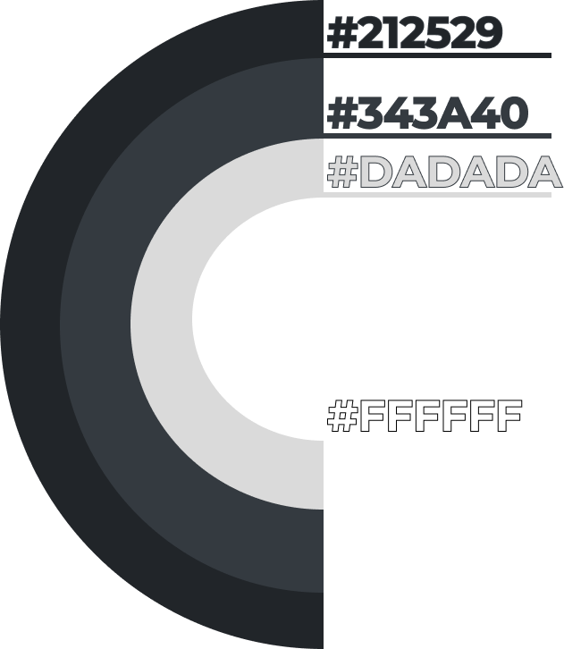
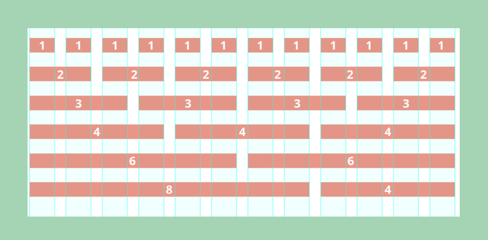
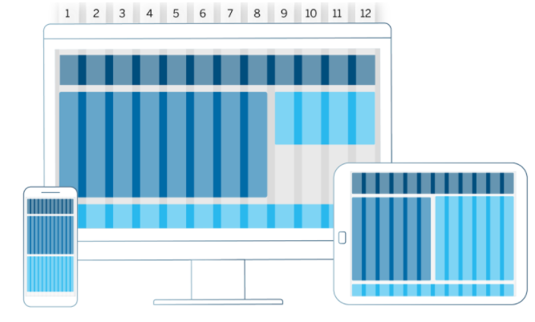
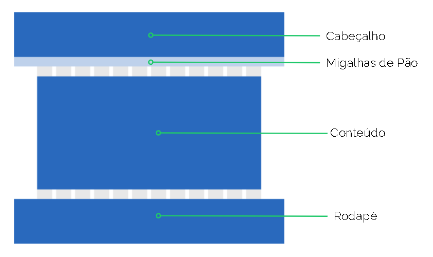

# Guia de Estilo 

O guia de estilo visual orienta a unidade e a coerência visual na apresentação de uma marca e em sua oferta de serviços no cenário digital.

| Data       | Versão | Descrição                                           | Autor              |
| ---------- | ------ | --------------------------------------------------- | ------------------ |
| 11/03/2021 | 0.1    | Adicionado template               | Gabriel Albino |
| 11/03/2021 | 0.2    | Adicionado Objetivos, Cores e Layout Iniciado Tipografia e Protótipos |

## Objetivo
Esse documento tem como objetivo demonstrar os elementos de interfaces, servindo de ponto de partida para garantir um serviço digital consistente, independente do seu alcance, número de páginas ou micro serviços.

Em qualquer situação, o guia de estilo deve agir como a âncora de confiança que mantém todas as intenções de design criativo corretamente interpretadas e traduzidas para todos que estão trabalhando no desenvolvimento e na entrega de um serviço. 

O guia de estilo também tem função de repositório para facilitar o trabalho dos desenvolvedores front-end: quando eles podem utilizar componentes comuns em diversas páginas, sem precisar criar soluções do zero a todo momento, o desenvolvimento adquire bastante velocidade

### 1. Cores
Esta paleta inclui as cores primárias e secundárias do **Parlamentaqui**. As cores base são utilizadas no portal para manter a consistência.

#### 1.1 Cores Primárias
As cores primáras se baseam em variações das cores verde e marrom. O verde representa a principal cor da bandeira Brasileira, servido para abraçar a nacionalidade e o representar o país. O Marrom representa a sujeira causada pela currupção, presente em diversas formas diferentes e em diferentes camadas da política.

|Hexadecimal|RGB|Nome|
|-|-|-|
|#A4D4B4|164,212,180|Verde Musgo|
|#3B1C32|59,28,50|Marrom Lívido|
|#2C2229|44,34,41|Marrom Tempestade|
|#D2FFE1|210,255,255|Menta Nevado|

#### 1.1 Cores Secundárias
Estas cores devem ser usadas para textos como parágrafos e títulos. E também usadas para destacar alguma seção da página.

|Hexadecimal|RGB|Nome|
|-|-|-|
|#212529|33,37,41|Cinza Tubarão|
|#343A40|52,58,64|Cinza Espacial|
|#DADADA|218,218,218|Cinza Alto|
|#FFFFFF|255,255,255|Branco|

### 2. Layout
Foram estabelecidas algumas diretrizes para garantir um bom comportamento do **Parlamentaqui** em todos os dispositivos.

#### 2.1 Grids
As grids garantem uma boa organização do conteúdo dentro do portal e devem ser respeitadas. 

O sistema de grid utilizado no projeto é o do Bootstrap, que usa uma série de contêineres, linhas e colunas para fazer o layout e alinhar o conteúdo. Ele é construído com flexbox e é totalmente responsivo. Abaixo está um exemplo e uma análise detalhada de como a grid se junta.

|Distância entre Colunas (Gutters)|Distância entre Linhas (Row)|
|-|-|
|24px|24px|

#### 2.2 Grids em dispositívos

A organização criada pelas grids deve ser respeitada em todos os dispositivos, especialmente por ser adaptável a todos eles.

#### 2.3 Estrutura padrão (elementos)

Todas as páginas do portal deve seguir a seguinte estrutura

### 3. Tipografia
A Fonte escolhida para o **Parlamentaqui** foi a Open Sans. E é a família de fonte usada em conteúdos de todo o site. Para títulos, foi escolhida a Montserrat. Ambas as fontes encontram-se no Google Fontes, garantindo qualidade e velocidade no carregamento.

[INSERIR IMAGEM DA FONTE AQUI]

### 4. Elementos da UI
Veremos os elementos até então utilizados na UI do **Parlamentaqui**, como ícones, botões e itens transversais (cabeçalho, rodapé, migalhas de pão). Este documento serve como guia para definir bons modos de aplicação, preservando sua legibilidade e estrutura dentro do portal.

#### 4.1 Cabeçalho

#### 4.2 Rodapé

#### 4.3 Migalhas de pão

#### 4.4 Frameworks

## Protótipos de alta fidelidade

### 1. Home (v0.1)

### 2. Perfil do deputado (v0.1)

### 3. Resultados da busca (v0.1)